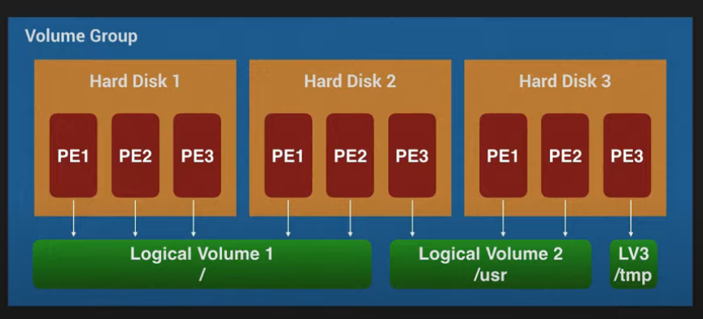
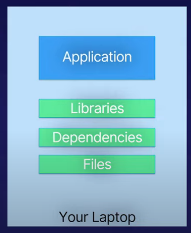
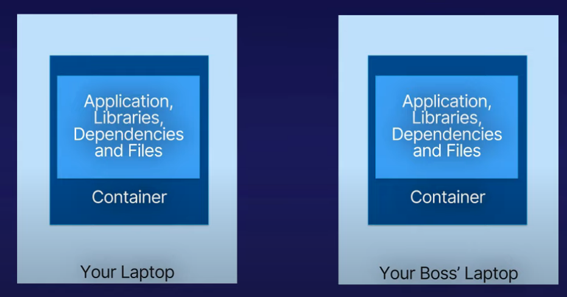
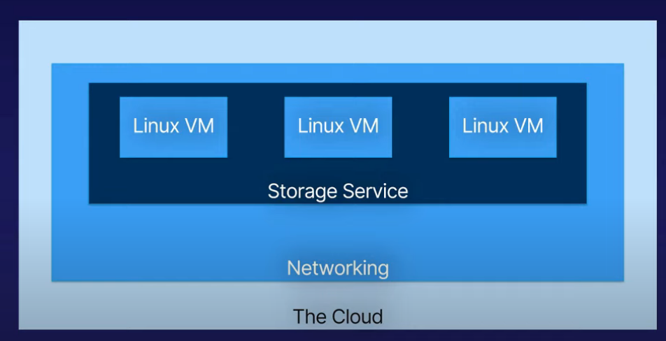

**September 14, 2022**

# Design hard disk layout
Linux or Unix systems use the forward slash to separate directories all of the system.

 ## Linux hard disk layout
- / 
	- /etc
	- /usr
		- User directory where user binaries are stored when packages are installed.
	- /home
		- This is where users home directories live and a place for them to store their own files.
	- /boot
		- This directory stores the bootloaders and all the images required for booting
	- /var
		- This directory contains variable data like system logs mail principle files and so on
	- /tmp
		- This directory is unique storage area that everyone on the system can write to.

## Partitions
- divide storage into multiple pieces
- Allows dual booting
- Separation of files
- Data organisation
- System Protection

### System protection with partitions
- Create partitions
- Mount them to direction
- We can mount to:
	- /home
	- /var
	- /tmp

`/tmp is available to all the users in the system, this could be dangerous as anyone can create junk files and overload the system that can harm the system. It is bad from a system administrator perspective. So, the solution for this is to create a separate partition and mount it to /tmp.`

### Swap partition
- Swap partition refer to as a virtual memory.
- It is used when the physical memory or ram is full if the system needsd more resources inactive pages of memory. 
- There is no need for a forward slash (/) for swap partition as it can't be accessed by the other users.
- Swap partition can be messy if not managed properly.

### LVM
- LVM: **L**ogical **V**olume **M**anager
- Split disks into pools
- Create partitions from pools
- Can grow or shrink partitions

## Install a boot manager
- Boots a Linux system
- Runs before the operating system
- Can be configured from the operating system
- Common boot loaders
	- LILO: one of the oldest 
	- GRUB Legacy
	- GRUB2

### To check the version of boot loader
> grub-probe --version

### Location of main grub config file
> /boot/grub/grub.cfg

In grub legacy it is `menu.lst`

### Location of files that generate grub.cfg
> cd /etc/grub.d

### Location to change the default grub
> sudo vim /etc/default/grub

### Location of the command running
> which update-grub

### Update the grub config 
> sudo update-grub

`This will only update the configuration file.`

### Install grub after configuration
> sudo grub-install /dev/sda

# Manage shared libraries
Library is an assortment of pre-complied piece of code that can be reused in a program. 
- Libraries
	- Shared
	- Re-useable

- Linking
	- Static Linking
	- Dynamic Linking

In **static linking**, a single application will have to install a library inorder to use. That library is only limited to that application.

Where as in **Dynamic Linking** a library is shared between application. This is helpful in many cases such as   all the programs will use a shared library and you can update that shared library and all the application will run that shared library.

But in static linking you will have to update the library in every single application.

## Location of shared library
> cat /etc/Id.so.conf

The libraries are distributed in many small pieces such that it will be easier to manage.

### The location of python libraries
> cd /etc/ld.so.conf.d
> ls
> cat libc.conf `This will give the location for python library which is /usr/local/lib`
> `we can check that file`
> cd /usr/local/lib
> `We can see the python libraries` 

`multiarch support which are libraries for different cpu architecture types if we wanted to have another directory`

## Make a directory to be search by dynamic linker
- For this we will have to create our own file. we have to be in ``/etc/ld.so.conf.d`
	> sudo via name.conf
	> name the library name libraries and we can include home/name/lib

- ldconfig will configure dynamic linker run-time bindings

> sudo ldconfig `now this is linked`

## Environment variable
Environment variable will create a temporary variable which are customized pieces of text that are specific to your particular login shell.

> export NAME_LIBRARY_PATH=/home/name/lib `path in which we need.`

## LDD 
LDD will print shared object dependencies. This means if you run ldd on an application it will show us which libraries it's linked to. For example

- We can see which libraries are linked with cat command.
- First we need to find the location of cat command
- `which cat`
- We got the location which is `/usr/bin/cat`
- now we can use ldd to see all the dynamic libraries linked with by running `ldd /usr/bin/cat`

# Use Debian package management
- dpkg
	- Debian pacakge Manager
	- Install software
	- Upgrade software
	- Remove software
	- Low-level tool
- apt
	- Advanced Pacakaging Tool
	- High level tool
	- Install packages
	- Upgrade packages
	- Remove packages
	- Upgrade entire system
	- Handle all package dependencies automatically `This will install the required library for the application`

## Show all the packages that are installed.
> dpkg -l | less

## Install via dpkg
first we need to install the .deb file.
> sudo dpkg -i file.deb

### Purge
Purge will remove the application and any configuration files that were installed by that application.
> sudo dpkg --purge file.deb

## Install via apt
> sudo apt-get install name

### To see the sources list 
> cat/vi /etc/apt/sources.list

### Remove via apt
> sudo apt-get remove name
> `It will remove the packages but can not remove dependencies`

### To remove application and dependencies
> sudo apt-get autoremove --purge name

### To tell information about package's dependencies
> apt-cache depends package-name | less

It can also be used to search for a package
> apt-cache search package-name

| sudo-apt upgrade                                            | sudo-apt dist-upgrade |
| ----------------------------------------------------------- | --------------------- |
| It will upgrade all the installed packages to new versions. | It will upgrade everything and install or remove any packages required                      |

## Using RPM and YUM package Management
- rpm and yum are the backbone of red hat centos and fedora linux distributions
- RPM
	- **R**edHat **P**ackage **M**anager
	- rpm command
	- Low level tool
	- Install package
	- Update package
	- Remove package
- YUM
	- **Y**ellowdog **U**pdater, **M**odified
	- Replaced YUP, Yellowdog Updater
	- Utilises online repositories
	- Manage dependencies

### YUM Configurations file
> vim /etc/yum.conf

### YUM source URL list
> cd /etc/yum.repose.d 
> `They are split out into a file per repository`

### Update in YUM
This will tell you about files that needs to be updated. This is kind of a combination between the apt update and upgrade.
> sudo yum update

### Download a package without install
> sudo yum install --downloadonly --downloaddir=/location package-name

Yum didn't used to have yum command. You used to have to download an application called `yumdownloader package-name` 

- rpm files are cpio files which is an archive which combines lots of files into a single one. 

### To view the rpm files
We can directly view the file by converting it to cpio which will give us gibberish.
> rpm2cpio file.rpm

but if we add cpio -idvm we can redirect the output of this command into the input of this command. Then view the files here.
> rpm2cpio file.rpm | cpio -idvm

### Install the RPM
> sudo rpm -i file.rpm

### To Find out which package it belongs to
> rpm -qf /etc/protocols
> `query format`

rpm can also has a command which will verify that all files associated with an installed packages are present.

### To verify the .rpm file
When you run verify command no output means good result.
> sudo rpm --verify setup

### To verify the whole system/machine
> sudo rpm -Va

There are few symbols below missing. To see what they mean 
> man rpm
> / to search in manual
> /VERIFY OPTIONS
> we can see the meaning of those file.

## To remove package in YUM
> sudo yum remove package-name.

# Zypper and dnf
zypper and dnf both are package management system.

zypper is packet management for opensuse
	- Install Packages
	- Remove Packages
	- Update 
	- Query

### To see zypper repository
> zypper repos

### To update packages in zypper
> sudo zypper refresh

### To Install packages in zypper
> sudo zypper in package-name

### To remove packages and dependencies.
> sudo zupper remove --clean-deps package-name

## dnf
- It stands for dendify yum.
- It is the next generation of the yellow dog updater modifed or yum

### Install dnf 
> sudo yum/apt-get install dnf

### To get information about a package
> dnf info git

### To get information about available packages
> sudo dnf list

### See installed packages
> dnf list installed

### To check update
> dnf check-update

### To install via dnf
> sudo dnf install package-name

### To remove via dnf
> sudo dnf remove package-name.

# Linux as a virtualization guest
- Advantages
	- Multiple operating systems on the same computer
	- Extra hardware is not necessary
	- Entire Machines can be cloned, backed up and easily restored.
	- Easy to manage and maintain
	- Protect the host machine
- Disadvantage
	- Less efficient due to accessing hardware indirectly
	- Performance may be hindered by the host

## Containers
A container is a standard unit of software that packages up code and all it's dependencies so the application runs quickly and reliably from one computing environment to another. 

For example: you are installed a new and rare application and you had to manually download libraries, dependencies and files which was very time consuming. 

And a friend asked for that application. It will be difficult for him. So, you can use a container file which will create a seprate space within your device and within that space you can download and install the application with all the necessary items. Later share that containers with your friend.

Docker and kubernetes are two most popular container.

# Cloud Computing
Linux can also be used in cloud. Basically the cloud provide a networking layer so that we can control traffic allowed in and out of your network. You can install multiple servers on the same local network inside the cloud. There is also a storage serveice which controls the virtual hard disks that can be detached and reattached to other virtual machines as well as snapshot them for backup, resize.

## Cloud-init
- Cloud instance initialization
- A set of scripts that are executed when an instance is started
- Applies user data to your instances automatically
- Works with many popular operating systems
- Works on almost all public clouds:
	- AWS
	- Microsoft Azure
	- Google Cloud Platform
	- Rackspace, IBM, Alibaba, CloudStack, Bigstep, Hetzner, Joyent.

