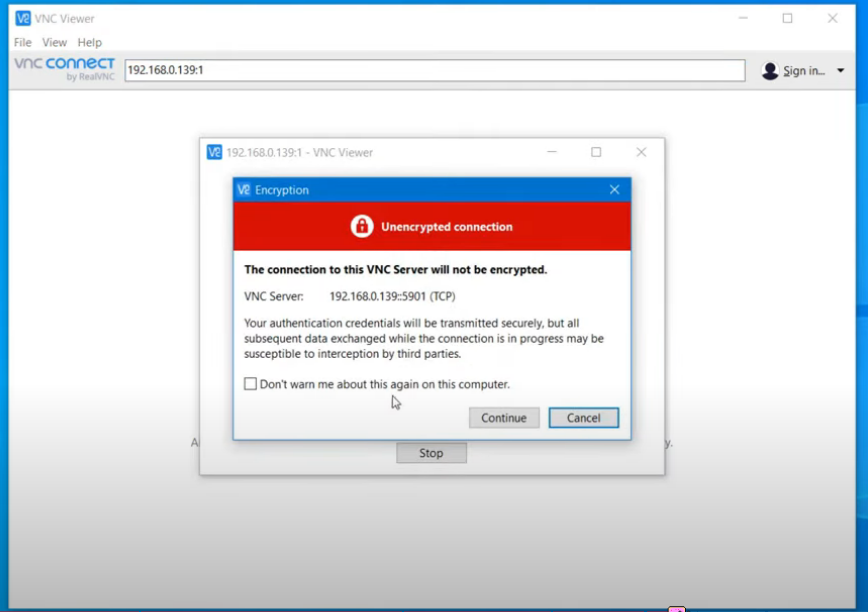

# x11
- x 11 is the x window system that linux uses to give a graphical user interface.

### Install xorg
> sudo apt-get update
> sudo apt-get xorg

### Start xorg
> startx

- we downloaded xorg but it doesnot give it a window manager.
- Openbox is a windows manager that gives menus, title bar.
	- Lightweight window manager

### Install openbox
> sudo apt-get install openbox
> To start openbox, we can simply use `startx` command

### Location of x11
```bash
cd /etc/X11/Xsession.d/
# There is a startup file which contains notes that describe how the openbox got started.
There is location of startx command in 
ls /etc/alternatives/x-session-manager
```
 
 ---
 - As we know linux likes to split the configuration file into multiple files so its easier to manage. x11 file lives in `/usr/share/x11`.
 - There is a directory called `xorg.conf.d`. All the files joins together to make xorg

### Traditional location of xorg file
**Exam question**
```bash
cd /etc/x11/xorg.conf
```

### Combined xorg.conf 


It is possible to run multiple x servers on a single linux server and each server is identified with a colon and a number referred to as the display number

```bash
ps aux | grep xorg #xorg needs to be started.
#we can see that xorg binary is listening on colon zero(Thats the first display that got created). but if we start another then it would be 1.
export DISPLAY=:0
xterm
xwininfo #This command will give alot of information about it when you click on the window. We can see information such as Width, Depth, Height, etc
xdpyinfo | less #This gives technical information about the xorg server thats running.
xhost #It restricts who is allowed to access the x server.
xhost + #Anyone can connect to the server.
xhost - #Only authorized clients can connect. This lets someone to run a graphical application on your x server without being on the server from a different machine.
export Display=website.com:0 #We can block ip that we want them to connect.
```

# WAYLAND
- Simpler replacement for Xwindows
	- Easier to develop and maintain 
	- Gnome and KDE expected to be ported to it.
- Protocl for a compositor
	- Allows the windows manager to talk to its client or application
- Weston reference inplementation
	- A minimal anf fast compositor
	- Suitable for embedded and mobile use cases.

# Setup a display manager
- It is the graphical interface displated at the end of the boot process which handles the login of the user to xwindows.
- It also starts and prepares the desktop environment.
- There are alot of display managers available.
	- **XDM:** The default bare bone display manager
	- **GDM:** Gnome display manager
	- **KDM:** KDE display manger
	- **LightDM:** Lightweight display manager

We are going to use **LightDM** 

#### Location of lightdm
```bash
cd /etc/lightdm/ #We can list and see that there is a user configuration file
vim users.conf #This allows us to restrict the minimum uid for a user to appear in the user list when logging in to 500. This is so we don't have system users being able to log into the system. 
We can also explicitly hide usernames and hide shells that can be chosen.
```

### To go back into terminal
>ctrl + alt + f1

### To go back into graphics
>ctrl + alt + f7

### To change the default default login manager
>sudo systemctl set-default graphical.target

# Remote Sessions
We can use vnc server as a protocol that can access the linux desktop remotely.

### install vnc server
> sudo apt-get install tightvncserver openbox

### To start vncserver
- we can simply write tightvncserver in terminal.
- It will ask to create a password. The password can be anything. For now I have given kali123
- That created a new display.
- We need to configure what will open when we connect to this session and that uses script here.

- **xdmcp** is another remote desktop protocol which is intergrated into xorg.

# Accessibility in xwindows
- We will open with Gnome. We can see that there is a search option we will search for **universal access menu**
- This has a lot of settings which help out with accessiblity in your graphical user interface.

--- 
- Exam covers an application that is quite old and no longer available in ubuntu which is called the gnome on-screen keyboard. 
- Exam refer to it as g-o-k gnome on-screen keyboard.
