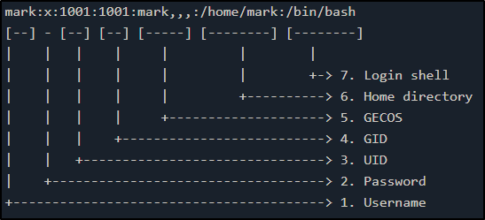
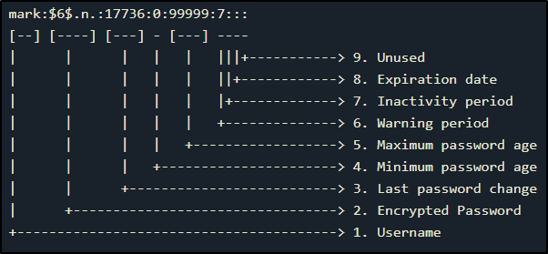
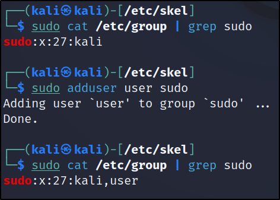
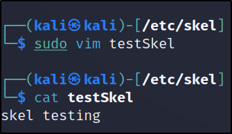
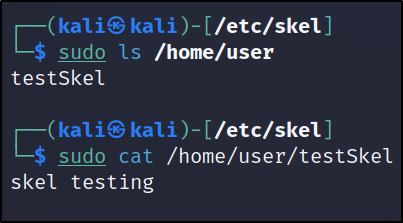
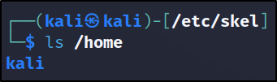

# Manage User and Group Accounts and Related System Files
## /etc/passwd file
A plain text-based database with information about all user accounts is **/etc/passwd** file.
It has **644** permission. So, this file can only be edited by users with sudo privileges, but is readable by all system users.

Here, the first line shows the root user, followed by system, and normal user accounts at the end. 
Every line of the file is separated into seven segments using a colon ":".

**Username:** This section consists of username of the user.
**Password:** The "x" here represents that the password is stored in shadow file. 
**UID:** This is a unique number assigned to each user. This assigned number is used to refer to a user by the operating system. 
**GID:** This ID refers to the user's primary group.
A user canbelong to multiple groups. But it only shows the user's primary group. 
**GECOS:** It shows full name of the user.  
This field contains:
- Full name
- Room number
- Phone number
- Other contact information

**Home Directory:** This shows the absolute path to the user's home directory.
**Shell:** The default shell when the user logins. 
## /etc/shadow file
**/etc/shadow** is a file that stores encryptyed passwords for each users.
This file is owned by the user root, and group shadow. It has **640** permissions. So, we need to be root, or need sudo access to open this file. 
Every line of the file is separated into nine segments using a colon ":".

**Username:** This contains the username of the user account. 
**Password (Encrypted):** This contains the password of the user in an encrypted form. 
> -   `$1$` – MD5
> -   `$2a$` – Blowfish
> -   `$2y$` – Eksblowfish
> -   `$5$` – SHA-256
> -   `$6$` – SHA-512

*If the password field contains "\*" or "!", logging in to the user account using password authentication is not possible. *

**Last Password Change:** The date when password for the user was last changed. 
**Minimum Password Age:** Number of days that needs to pass before the user's password can be changed again. 
**Maximum Password Age:** The maximum number of days after which the user's password must be changed. 
**Warning Period:** The number of days before the password expires where the user is warned to change the password. 
**Inactivity Period:** The number of days after the user's password expires, before the account is disabled.
**Expiration Date:** The date when the user account was disabled. 
**Unused field:** The last unused section is empty, and is reserved for future use. 
## /etc/group file
This file manages groups and users. /etc/group is a simple file that contains a list of groups and the members belonging to each group. 
An entry in this file looks like:
> group:group_password:GID:list_of_users

Here, the password section is usually empty as it is almost never used. 
**Adding a user with username "user" to "sudo" group:**
> sudo adduser user sudo

## /etc/skel directory
/etc/skel (skeleton directory) is a directory which is used to initiate home directory whan a user is first created. 
When a new user is created, the files in /etc/skel directory is automatically created in the user's home directoy. 
Example:
**Creating a new file "testSkel" inside the /etc/skel directory:**

**Creating a new user:**
> sudo adduser user

**Checking new user's home directory:**

Hence, the file created inside the /etc/skel directory was found in the newly created user's home directory.

**To delete a user, remove its home directory and mailbox:**
> sudo userdel --force --remove user

Here, the user with username "user" was successfully deleted along with it's home directory and mailbox.
**To delete a group:**
> sudo groupdel "groupname"

## Automate System Administration tasks by Scheduling Jobs
