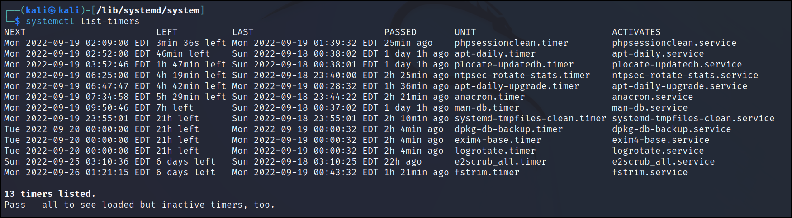
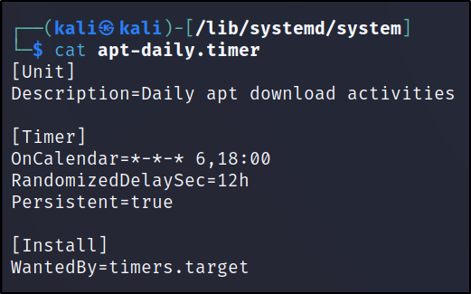
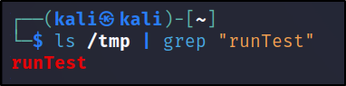

# Manage User and Group Accounts and Related System Files

## /etc/passwd file

A plain text-based database with information about all user accounts is **/etc/passwd** file.

It has **644** permission. So, this file can only be edited by users with sudo privileges, but is readable by all system users.

  

Here, the first line shows the root user, followed by system, and normal user accounts at the end.

Every line of the file is separated into seven segments using a colon ":".

  


  

**Username:** This section consists of username of the user.

  

**Password:** The "x" here represents that the password is stored in shadow file.

  

**UID:** This is a unique number assigned to each user. This assigned number is used to refer to a user by the operating system.

  

**GID:** This ID refers to the user's primary group.

A user canbelong to multiple groups. But it only shows the user's primary group.

  

**GECOS:** It shows full name of the user.  

This field contains:

- Full name

- Room number

- Phone number

- Other contact information

  

**Home Directory:** This shows the absolute path to the user's home directory.

  

**Shell:** The default shell when the user logins.

## /etc/shadow file

**/etc/shadow** is a file that stores encryptyed passwords for each users.

This file is owned by the user root, and group shadow. It has **640** permissions. So, we need to be root, or need sudo access to open this file.

Every line of the file is separated into nine segments using a colon ":".

  


  

**Username:** This contains the username of the user account.

  

**Password (Encrypted):** This contains the password of the user in an encrypted form.

  

> -   `$1$` – MD5

> -   `$2a$` – Blowfish

> -   `$2y$` – Eksblowfish

> -   `$5$` – SHA-256

> -   `$6$` – SHA-512

  

*If the password field contains "\*" or "!", logging in to the user account using password authentication is not possible. *

  

**Last Password Change:** The date when password for the user was last changed.

  

**Minimum Password Age:** Number of days that needs to pass before the user's password can be changed again.

  

**Maximum Password Age:** The maximum number of days after which the user's password must be changed.

  

**Warning Period:** The number of days before the password expires where the user is warned to change the password.

  

**Inactivity Period:** The number of days after the user's password expires, before the account is disabled.

  

**Expiration Date:** The date when the user account was disabled.

  

**Unused field:** The last unused section is empty, and is reserved for future use.

## /etc/group file

This file manages groups and users. /etc/group is a simple file that contains a list of groups and the members belonging to each group.

An entry in this file looks like:

  

```

group:group_password:GID:list_of_users

```

Here, the password section is usually empty as it is almost never used.

**Adding a user with username "user" to "sudo" group:**

```bash

sudo adduser user sudo

```

  


  

## /etc/skel directory

/etc/skel (skeleton directory) is a directory which is used to initiate home directory whan a user is first created.

When a new user is created, the files in /etc/skel directory is automatically created in the user's home directoy.

Example:

**Creating a new file "testSkel" inside the /etc/skel directory:**

  


  

**Creating a new user:**

```

sudo adduser user

```

  


  

**Checking new user's home directory:**

  


  

Hence, the file created inside the /etc/skel directory was found in the newly created user's home directory.

  

**To delete a user, remove its home directory and mailbox:**

  

```bash

sudo userdel --force --remove user

```

  


  


  

Here, the user with username "user" was successfully deleted along with it's home directory and mailbox.

**To delete a group:**

  

```bash

sudo groupdel "groupname"

```

  

## Automate System Administration tasks by Scheduling Jobs

**Job scheduling** is a feature that allows a user to submit a command or program for execution at a specified time in future.

It is useful to schedule system maintainance commands to run during non-working hours when it does now disrupt normal business activities,

### **at** Command

This command-line utility is used to schedule a command at a particular time in future. Jobs created using the **at** command are executed only once.

**Using the at command:**

We must first execute the **at** command along with the time when the job is needed to be scheduled to.

  

```bash

at 12 PM

```

  


  

To specify that we have finished providing commands, we need to press: Ctrl + d.

  

```

ctrl + d

```

  

If the time specified is already passed, the command is executed at the same time next day.

Different other ways how we can specift time:

- Now + 25 minutes

- 9:00AM tomorrow

- 9:00AM + 7 days

When the jobs run, there's no monitor associated with the jobs. But any STDOUT is directly mailed to the user who submitted the job.

#### To List Pending Jobs

  

```bash

atq

```

  


  

#### Removing Jobs

  

```bash

atrm 2

```

  

Here, "2" is the job number that we can get while lising the pending jobs.

  


  

After executing "atrm 2", the job number 2 is removed above.

  

### batch Command

**batch** command is used to execute the provided commands when system load average drops below 1.5.

  


>**Linux system load** is a measurement of the computational work the system is performing.

This measurement is displayed as a number.

An idle system has a load average of 0. Each running process using the CPU resources, or waiting for CPU resources adds 1 to the load average.

  
  


  

The difference between batch command and at command is that the user never specifies date and time while using batch command.

  

```

When we need to do something that isn’t a regular process, we can schedule it with `at`.

If we want to run a task only when the system load is low enough, we can use `batch`.

```

  

### cron

**cron** is used when the user has to schedule jobs to run on a regular basis.

This program runs in the background and checks special tables called *cron tables* for jobs that are scheduled to run.  It is also known as **crontab**.

**To install of update job in crontab:**

  

```bash

crontab -e

```

  

#### Cron Table Format

```

*    *    *   *    *  Command_to_execute

|    |    |    |   |      

|    |    |    |    Day of the Week ( 0 - 6 ) ( Sunday = 0 )

|    |    |    |

|    |    |    Month ( 1 - 12 )

|    |    |

|    |    Day of Month ( 1 - 31 )

|    |

|    Hour ( 0 - 23 )

|

Min ( 0 - 59 )

```

  

Example:

**To run "/bin/ls" at 3 AM everyday:**

  


  

**To list cron files run daily:**

  

```bash

ls /etc/cron.daily

```

  

**A list of only users that can use cron:**

  

```bash

cat /etc/cron.allow

```

  

**A list of users that cannot use cron: **

  

```bash

cat /etc/cron.deny

```

  

### anacron

Cron jobs are suitable for servers that are run 24/7. But anacron is better suited for desktops and laptops that are powered off from time to time.

**anacron** command controls the file /etc/anacrontab.

  


  

- Here, the first field specifies recurrence period. Here, 1 means it is run everyday and 7 means it is run every week. To run the job every month, we can enter **@monthly** in the first field.

- The second field specifies delay. This delay is the delay period in minutes which the anacron waits after the system starts before executing the job.

- Third field is identifier. It specifies the name for the timestamp file. This should be unique for every job.

- The last field is the command run using the anacron.

  

## Further systemd
### systemd timers
systemd timers are the files that end with "*.timer*".
Like cron jobs, systemd timers can trigger events—shell scripts and programs—at specified time intervals. 
Timers can also do some things that cron jobs cannot. For example, a timer can trigger a script or program to run a specific amount of time after an event such as boot, startup, completion of a previous task, or even the previous completion of the service unit called by the timer.

To list current systemd timers:
```bash
systemctl list-timers
```



Example:



To change when it is run, we need to modify the *OnCalender* line. A file can have multiple *OnCalender* lines.

This *OnCalender* line is divided into 3 parts:
-   `*` - To signify the day of the week eg:- Sat,Thu,Mon
- `*-*-*` - To signify the calendar date. Which means it breaks down to - `year-month-date`.
	-   `2021-10-15` is 15th of October
	-   `*-10-15` means every year at 15th October
	-   -   `*-01-01` means every new year.
-   `*:*:*` is to signify the time component of the calnedar event. So it is - `hour:minute:second`

In case there is no need for modification in any component, we can just skip it.
Example:

```bash
Wed *-*-* 17:48:00
#Can also be written as ->
Wed, 17:48
```

|       Explanation        |        Systemd timer        |
|:------------------------:|:---------------------------:|
|       Every Minute       |      \*-\*-\* \*:\*:00      |
|      Every 2 minute      |     \*-\*-\* \*:\*/2:00     |
|     Every 5 minutes      |     \*-\*-\* \*:\*/5:00     |
|     Every 15 minutes     |    \*-\*-\* \*:\*/15:00     |
|    Every quarter hour    |    \*-\*-\* \*:\*/15:00     |
|     Every 30 minutes     |    \*-\*-\* \*:\*/30:00     |
|    Every half an hour    |    \*-\*-\* \*:\*/30:00     |
|     Every 60 minutes     |     \*-\*-\* \*/1:00:00      |
|       Every 1 hour       |        \*-\*-\* \*:00:00        |
|       Every 2 hour       |       \*-\*-\* \*/2:00:00       |
|       Every 3 hour       |       \*-\*-\* \*/3:00:00       |
|     Every other hour     |       \*-\*-\* \*/2:00:00       |
|       Every 6 hour       |       \*-\*-\* \*/6:00:00       |
|      Every 12 hour       |      \*-\*-\* \*/12:00:00       |
|        Hour Range        |      \*-\*-\* 9-17:00:00       |
|  Between certain hours   |      \*-\*-\* 9-17:00:00       |
|        Every day         |       \*-\*-\* 00:00:00        |
|          Daily           |       \*-\*-\* 00:00:00        |
|        Once A day        |       \*-\*-\* 00:00:00        |
|       Every Night        |       \*-\*-\* 01:00:00        |
|     Every Day at 1am     |       \*-\*-\* 01:00:00        |
|     Every day at 2am     |       \*-\*-\* 02:00:00        |
|      Every morning       |       \*-\*-\* 07:00:00        |
|      Every midnight      |       \*-\*-\* 00:00:00        |
|  Every day at midnight   |       \*-\*-\* 00:00:00        |
| Every night at midnight  |       \*-\*-\* 00:00:00        |
|       Every sunday       |     Sun \*-\*-\* 00:00:00      |
|       Every friday       |     Fri \*-\*-\* 01:00:00      |
| Every friday at midnight |     Fri \*-\*-\* 00:00:00      |
|      Every saturday      |     Sat \*-\*-\* 00:00:00      |
|      Every weekday       |  Mon...Fri \*-\*-\* 00:00:00   |
|      weekdays only       |  Mon...Fri \*-\*-\* 00:00:00   |
|     monday to friday     |  Mon...Fri \*-\*-\* 00:00:00   |
|      Every weekend       |   Sat,Sun \*-\*-\* 00:00:00    |
|      weekends only       |   Sat,Sun \*-\*-\* 00:00:00    |
|       Every 7 days       |      \* \*-\*-\* 00:00:00       |
|        Every week        |     Sun \*-\*-\* 00:00:00      |
|          weekly          |     Sun \*-\*-\* 00:00:00      |
|       once a week        |     Sun \*-\*-\* 00:00:00      |
|       Every month        |      \* \*-\*-01 00:00:00      |
|         monthly          |      \* \*-\*-01 00:00:00      |
|       once a month       |      \* \*-\*-01 00:00:00      |
|      Every quarter       | \* \*-01,04,07,10-01 00:00:00 |
|      Every 6 months      |    \* \*-01,07-01 00:00:00    |
|        Every year        |     \* \*-01-01 00:00:00      |
|       Every Minute       |        \*-\*-\* \*:\*:00         |
|      Every 2 minute      |       \*-\*-\* \*:\*/2:00        |
|     Every 5 minutes      |       \*-\*-\* \*:\*/5:00        |
|     Every 15 minutes     |       \*-\*-\* \*:\*/15:00       |
|    Every quarter hour    |       \*-\*-\* \*:\*/15:00       |
|     Every 30 minutes     |       \*-\*-\* \*:\*/30:00       |
|    Every half an hour    |       \*-\*-\* \*:\*/30:00       |
|     Every 60 minutes     |       \*-\*-\* \*/1:00:00       |
|       Every 1 hour       |        \*-\*-\* \*:00:00        |
|       Every 2 hour       |       \*-\*-\* \*/2:00:00       |
|       Every 3 hour       |       \*-\*-\* \*/3:00:00       |
|     Every other hour     |       \*-\*-\* \*/2:00:00       |
|       Every 6 hour       |       \*-\*-\* \*/6:00:00       |
|      Every 12 hour       |      \*-\*-\* \*/12:00:00       |
|        Hour Range        |      \*-\*-\* 9-17:00:00       |
|  Between certain hours   |      \*-\*-\* 9-17:00:00       |
|        Every day         |       \*-\*-\* 00:00:00        |
|          Daily           |       \*-\*-\* 00:00:00        |
|        Once A day        |       \*-\*-\* 00:00:00        |
|       Every Night        |       \*-\*-\* 01:00:00        |
|     Every Day at 1am     |       \*-\*-\* 01:00:00        |
|     Every day at 2am     |       \*-\*-\* 02:00:00        |
|      Every morning       |       \*-\*-\* 07:00:00        |
|      Every midnight      |       \*-\*-\* 00:00:00        |
|  Every day at midnight   |       \*-\*-\* 00:00:00        |
| Every night at midnight  |       \*-\*-\* 00:00:00        |
|       Every sunday       |     Sun \*-\-\* 00:00:00      |
|       Every friday       |     Fri \*-\*-\* 01:00:00      |
| Every friday at midnight |     Fri \*-\*-\* 00:00:00      |
|      Every saturday      |     Sat \*-\*-\* 00:00:00      |
|      Every weekday       |  Mon...Fri \*-\*-\* 00:00:00   |
|      weekdays only       |  Mon...Fri \*-\*-\* 00:00:00   |
|     monday to friday     |  Mon...Fri \*-\*-\* 00:00:00   |
|      Every weekend       |   Sat,Sun \*-\*-\* 00:00:00    |
|      weekends only       |   Sat,Sun \*-\*-\* 00:00:00    |
|       Every 7 days       |      \* \*-\*-\* 00:00:00       |
|        Every week        |     Sun \*-\*-\* 00:00:00      |
|          weekly          |     Sun \*-\*-\* 00:00:00      |
|       once a week        |     Sun \*-\*-\* 00:00:00      |
|       Every month        |      \* \*-\*-01 00:00:00      |
|         monthly          |      \* \*-\*-01 00:00:00      |
|       once a month       |      \* \*-\*-01 00:00:00      |
|      Every quarter       | \* \*-01,04,07,10-01 00:00:00 |
|      Every 6 months      |    \* \*-01,07-01 00:00:00    |
|        Every year        |     \* \*-01-01 00:00:00      |


### systemd-run
This commands lets us create transient timer units. Here, we can configure a command to run without the service file. 
Example:
**Using syustemd-run to run command *touch /tmp/runtest* **
```bash
systemd-run --on-active=10 /bin/touch /tmp/runTest
```




## Localizaiton and Internationalization
